# ⛰️ Hanshills & Co.

**A premium investment and advisory platform for founders, businesses, and visionary leaders.**


---

## ✨ Overview

- **Private Equity & Venture Capital** — Strategic investments in high-potential ventures
- **Venture Studio** — Building and scaling innovative businesses from the ground up
- **Advisory Services** — Expert guidance for institutional and emerging leaders
- **Mountain Cohort** — An exclusive program for high-potential founders and business leaders

---

## 🏔️ The Cohort

The flagship offering—a 5-step application journey designed to identify and nurture exceptional founders.

```mermaid
flowchart LR
    A[🏠 Welcome] --> B[📝 Apply]
    B --> C[📋 Step 1<br/>Your Coordinates]
    C --> D[🛤️ Step 2<br/>Mountain Path]
    D --> E[⛰️ Step 3<br/>The Climb Ahead]
    E --> F[📄 Step 4<br/>Proof of Life]
    F --> G[🏆 Step 5<br/>Welcome to Summit]
    G --> H[✅ Confirmation]
    
    style A fill:#1a1a1a,stroke:#fff,color:#fff
    style B fill:#1a1a1a,stroke:#fff,color:#fff
    style C fill:#2d2d2d,stroke:#8B7355,color:#fff
    style D fill:#2d2d2d,stroke:#8B7355,color:#fff
    style E fill:#2d2d2d,stroke:#8B7355,color:#fff
    style F fill:#2d2d2d,stroke:#8B7355,color:#fff
    style G fill:#2d2d2d,stroke:#8B7355,color:#fff
    style H fill:#1a1a1a,stroke:#4ade80,color:#fff
```



Each step features:
- **Dynamic background transitions** — Unique mountain imagery per step
- **Form validation with Zod** — Robust client-side validation
- **Animated step indicators** — Visual progress tracking
- **Supabase integration** — Secure application storage
- **EmailJS notifications** — Automated confirmation emails

---

## 📁 Project Structure

```
hanshill/
├── public/
│   └── assets/
│       ├── images/
│       │   ├── cohort/          # Cohort backgrounds & assets
│       │   ├── icons/           # Service & feature icons
│       │   └── logos/           # Brand assets
│       └── resources/           # Backgrounds & textures
│
├── src/
│   ├── app/                     # Next.js App Router pages
│   │   ├── about/               # About Us
│   │   ├── advisory/            # Advisory Services
│   │   ├── cohort/              # Mountain Cohort
│   │   │   ├── apply/           # Application form
│   │   │   └── confirmation/    # Success page
│   │   ├── get-in-touch/        # Contact form
│   │   ├── insights/            # Market insights
│   │   ├── pe-vc/               # Private Equity & VC
│   │   ├── studio-venture/      # Venture Studio
│   │   ├── layout.tsx           # Root layout
│   │   ├── page.tsx             # Homepage
│   │   └── globals.css          # Global styles
│   │
│   ├── components/
│   │   ├── animations/          # Motion components
│   │   ├── cohort/              # ApplicationForm
│   │   ├── layout/              # Navbar, Footer
│   │   ├── sections/            # Page sections
│   │   │   ├── HeroSection
│   │   │   ├── ServicesSection
│   │   │   ├── PhilosophySection
│   │   │   ├── CohortCTASection
│   │   │   └── PartnerCTASection
│   │   └── ui/                  # Reusable components
│   │       ├── Button
│   │       ├── Card
│   │       └── SectionTitle
│   │
│   ├── lib/
│   │   ├── actions.ts           # Server actions
│   │   ├── emailjs/             # Email configuration
│   │   ├── supabase/            # Database client
│   │   └── utils/               # Helper functions
│   │
│   ├── hooks/                   # Custom React hooks
│   ├── styles/                  # Additional styles
│   └── types/                   # TypeScript definitions
│
└── supabase/                    # Database migrations
```

---

## 🚀 Quick Start

```bash
# Clone the repository
git clone https://github.com/your-username/hanshill.git

# Navigate to project
cd hanshill

# Install dependencies
npm install

# Set up environment variables
cp .env.example .env.local

# Run development server
npm run dev
```

Open [http://localhost:3000](http://localhost:3000) to view the site.

---

## ⚙️ Tech Stack

| Category | Technology |
|----------|------------|
| **Framework** | Next.js 16 (App Router) |
| **Language** | TypeScript 5 |
| **Styling** | Tailwind CSS 4 |
| **Animations** | Framer Motion, GSAP |
| **Forms** | React Hook Form + Zod |
| **Icons** | Lucide React |

---

## 🎨 Design System

The website employs a refined, premium aesthetic:

- **Color Palette** — Deep blacks, pristine whites, and warm earth tones
- **Typography** — Display fonts for headlines, clean sans-serif for body
- **Spacing** — Consistent 72px margins, harmonious vertical rhythm
- **Components** — Glassmorphism cards, gradient borders, subtle animations

---

## 📄 Pages

| Route | Description |
|-------|-------------|
| `/` | Homepage with hero, services, philosophy |
| `/about` | Company story, vision, and team |
| `/pe-vc` | Private Equity & Venture Capital |
| `/studio-venture` | Venture Studio services |
| `/advisory` | Advisory & consultation booking |
| `/insights` | Market perspectives & reports |
| `/cohort` | Mountain Cohort program |
| `/cohort/apply` | 5-step application form |
| `/get-in-touch` | Contact form |

---

**made with <3, made by advait.**
